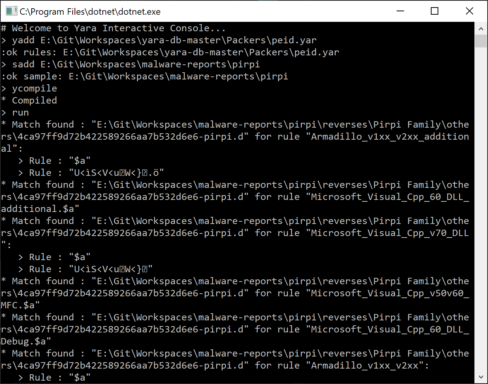

[](https://opensource.org/licenses/Apache-2.0)
[](https://www.nuget.org/packages/dnYara/)

# dnYara

```
     _                         
  __| |_ __/\_/\__ _ _ __ __ _ 
 / _` | '_ \_ _/ _` | '__/ _` |
| (_| | | | / \ (_| | | | (_| |
 \__,_|_| |_\_/\__,_|_|  \__,_|
 ```

**dnYara** is a .Net wrapper library for the native Yara library. 

## Why another .Net wrapper ?
Unlike other wrappers for .Net which are, for most, statically linked managed C++ wrapper, 
dnYara has been made in C# for `.Net Standard 2.0`, with the help of PInvoke. 
This way, it ensures interoperability and portability for various .Net application and OS ([learn more](INTEROP.md)).

## About Yara project
[YARA](https://virustotal.github.io/yara/) is an open-source tool, originally developed by Victor Alvarez, to help malware researchers quickly identify and classify malware samples. With YARA, you 
can create pattern-based rules to scan malwares.

With YARA, you can create malware family descriptions (or what you want to describe) based on text or binary patterns. In each description, or rule, a series of strings and a boolean statement are used to determine its logic.

## Pre-requisite

### Yara as a dynamic link library aside dnYara
dnYara works with the Yara library (libyara) compiled dynamically at his side, and with his exports.

It is important to make sure that you have Yara 3.8.0++ compiled beside it
- `libyara.dll` for Windows OS
- `libyara.so` for your linux / macosx platform

### Build YARA with CMake
The directory `libs\cmake` contains *CMake* files that can be used to build YARA with MSVC on Windows, or Makefile on Unix-based systems.

### Windows
To create  a Visual Studio 2019 project and build YARA on _Windows_:

```bash
mkdir build_yara
cd build_yara
cmake -G "Visual Studio 16 2019" ..\libs\cmake -DBUILD_SHARED_LIB=ON
cmake --build . --config [release|debug]
```

For earlier version of Visual Studio, please check your CMAKE_GENERATOR_PLATFORM variable:
- `Visual Studio 15 2017`
- `Visual Studio 14 2015`
- etc.

#### Linux
To create a Makefile and build YARA on _Linux_:

```bash
mkdir build_yara
cd build_yara
cmake -G "Unix Makefiles"  ../libs/cmake -DBUILD_SHARED_LIB=ON
cmake --build . --config [release|debug]
```

By default the Yara modules are not included, but you can either :
- select which you want to include: eg. `-D yara_CUCKOO_MODULE`
- or include all of them:  `-D yara_WITH_ALL_MODULES=ON`

***More information : https://github.com/airbus-cert/yara/tree/cmake/cmake***

## Usage

**dnYara** is made of the following classes:
- `YaraContext`
- `QuickScan`
- `Rule`
- `Compiler`
- `CompiledRules`
- `Scanner`
- `ScanResult`
- `Match`

It also uses a `dnYara.Interop` library which is dedicated to provide unmanaged PInvokes / DLLImports to the Yara native library.

## Limitations
- Does not support external variables for now (TODO)
- If an issue occurs on the native compiler side, it will crash when compiling rules: we are trying to handle the crash by operating with 2 compilers

## Samples

### Example
```C#
static void Main(string[] args)
{
    // Get list of yara rules
    string[] ruleFiles = Directory.GetFiles(@"e:\yara-db\rules\", "*.yara", SearchOption.AllDirectories).ToArray();

    // Get list of samples to check
    string[] samples = new[]
    {
        @"e:\malware-samples\",             // directory
        @"e:\speficic-samples\sample1.exe"  // file
    };

    // Initialize yara context
    using (YaraContext ctx = new YaraContext())
    {
        // Compile list of yara rules
        CompiledRules rules = null;
        using (var compiler = new Compiler())
        {
            foreach (var yara in ruleFiles)
            {
                compiler.AddRuleFile(yara);
            }

            rules = compiler.Compile();

            Console.WriteLine($"* Compiled");
        }

        if (rules != null)
        {
            // Initialize the scanner
            var scanner = new Scanner();

            // Go through all samples
            foreach (var sample in samples)
            {
                // If item is file, scan the file
                if (File.Exists(sample))
                {
                    ScanFile(scanner, sample, rules);
                }
                // If item is directory, scan the directory
                else
                {
                    if (Directory.Exists(sample))
                    {
                        DirectoryInfo dirInfo = new DirectoryInfo(sample);

                        foreach (FileInfo fi in dirInfo.EnumerateFiles("*", SearchOption.AllDirectories))
                            ScanFile(scanner, fi.FullName, rules);
                    }
                }
            }

        }
                
    }
}

public static void ScanFile(Scanner scanner, string filename, CompiledRules rules)
{
    List<ScanResult> scanResults = scanner.ScanFile(filename, rules);

    foreach (ScanResult scanResult in scanResults)
    {
        string id = scanResult.MatchingRule.Identifier;

        if (scanResult.Matches.Count == 1)
        {
            Console.WriteLine(
                $"* Match found : \"{filename}\" for rule \"{id}.{scanResult.Matches.First().Key}\"");
        }
        else
        {
            Console.WriteLine($"* Match found : \"{filename}\" for rule \"{id}\":");

            foreach (var vd in scanResult.Matches)
            {
                Console.WriteLine($"   > Rule : \"{vd.Key}\"");
            }
        }
    }
}
```

### YaraInteractive sample

A Yara Interactive console is a sample of Yara CLI made with dnYara. It works under Windows as well as for Linux or macOS.

It allows the user to add samples & rules to a context of analysis, and then run a scan:



Supported commands:
- `yadd <rules_path>`: Add a rule or rule directory to context.
- `sadd <samples_path>`: Add a sample or sample directory to context.
- `ycompile`: Compile rules added to context (must be done after `yadd` and before `run` commands)
- `run`: Run detection for the current context.
- `clear`: Clear the current context display.
- `exit`: Quit.

## Credits
- This project is under copyright of the **Airbus Computer Emergency Response Team (CERT)** and distributed under the **Apache 2.0 license**
